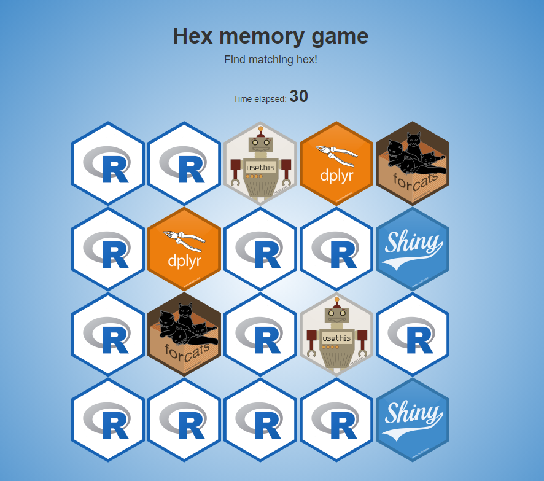

# Hex Memory Game

## Hex Game Overview
The Hex Game is a web-based memory game in which the player must find matching pairs of hexagonal tiles that are randomly arranged on the screen. The game consists of several modules, including the welcome screen, a timer module, and a hexagon module.

