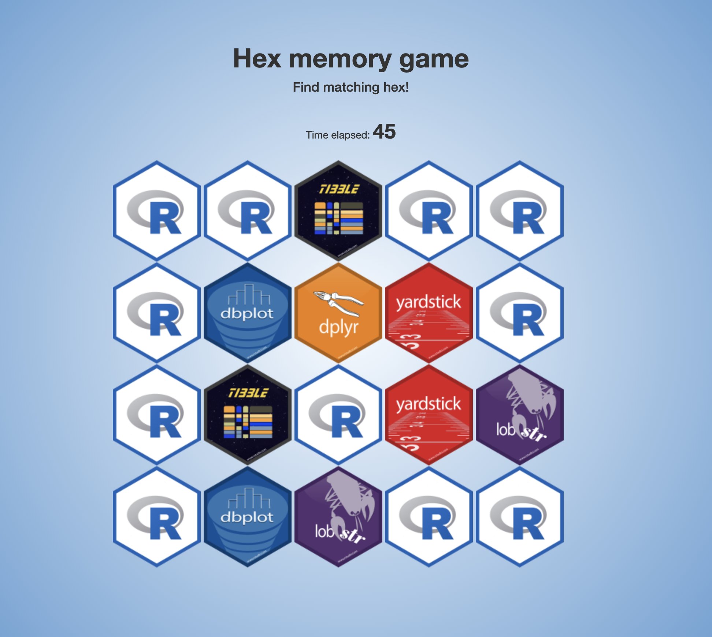

# Hex Memory Game

## Hex Game Overview
The Hex Game is a web-based memory game in which the player must find matching pairs of hexagonal tiles that are randomly arranged on the screen. The game consists of several modules, including the welcome screen, a timer module, and a hexagon module.

## Files
The game is built using Shiny, a web application framework for R. The code is organized into three files: ui.R, server.R, and global.R.

### ui.R
The ui.R file contains the user interface for the game. It is responsible for laying out the visual elements of the game and specifying their properties.

At the beginning of the file, several stylesheets are loaded to give the game its visual appearance. Then, the fluidPage() function is called to create the overall layout of the game. The fluidPage() function takes several arguments, including the title of the page and the size of the layout.

The layout is divided into several sections, each of which is contained within a fluidRow() function. Within each row, there are several columns specified by the column() function.

The first section contains the game title, which is centered on the screen using the text-align CSS property. The second section contains the timer, which displays the elapsed time since the game began. The third section contains the hexagons, which are generated by the server module.

Finally, the game ends with a modal dialog that appears when the player has found all of the matching pairs. The modal contains a congratulatory message, the elapsed time, a button to play again, and a button to share the player's score on Twitter.

### server.R

The server.R file contains the server module for the game. It is responsible for generating the hexagonal tiles, tracking the player's progress, and handling user input.

The server module is divided into several sections. First, the welcome and time modules are called to create the welcome screen and the timer, respectively.

Next, a list of hexagonal tiles is generated by randomly selecting images from the www/hex directory. The list is then shuffled to create a random arrangement of the tiles.

The hexagons are generated using the hex module, which takes the path to an image file and returns a reactive module containing a hexagonal tile. The hex module also tracks the state of each tile, including whether it has been flipped over, whether it is blocked, and whether it has been matched.

The server module also contains several reactive values that are used to track the state of the game. The results_mods reactive value is a list containing all of the hexagonal tiles. The results_mods_parse reactive value is a list containing the state of each tile, including whether it has been matched. The reset and block reactive values are used to reset and block tiles, respectively.

The observe() function is used to update the results_mods_parse reactive value whenever a tile is flipped over or matched.

Finally, the server module contains an observeEvent() function that listens for the reload button to be clicked. When the button is clicked, the server module reloads the page to start a new game.

### global.R

The global.R file contains the global variables and packages that are used throughout the game. The n_hex variable specifies the number of hexagonal tiles that will be generated, and the shareurl variable contains the URL that will be used to share the player's score on Twitter.

### Conclusion

Overall, the Hex Game is a fun and challenging memory game built using Shiny and R. It consists of a user interface file (ui.R), a server module file (server.R), and a global variables and packages file (global.R). The game is organized into several sections, including the welcome screen, the timer module, and the hexagonal tile module. The player must find matching pairs of hexagonal tiles that are randomly arranged on the screen. The game ends with a congratulatory modal dialog that displays the player's elapsed time and allows them to play again or share their score on Twitter.

